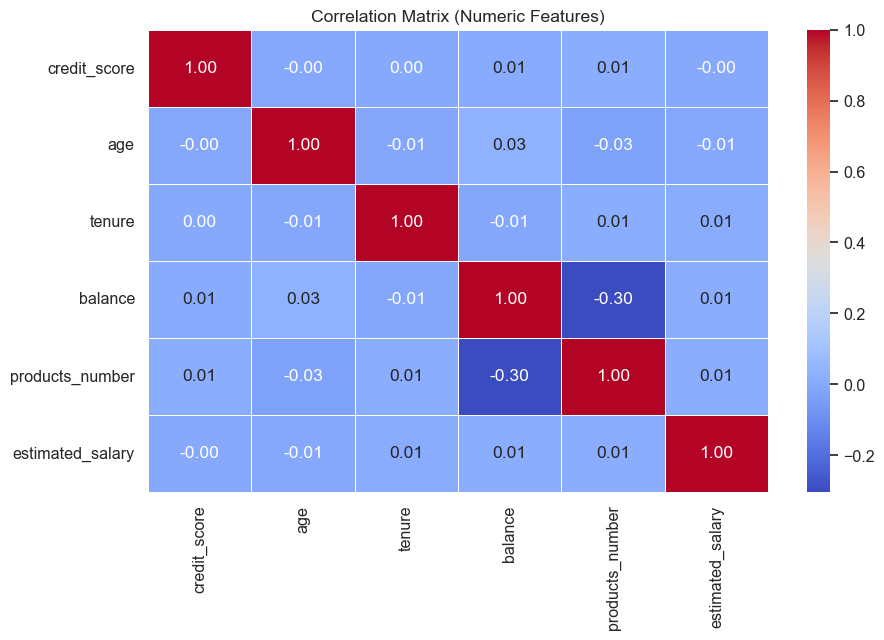
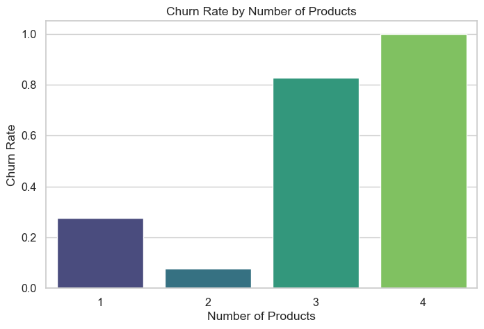
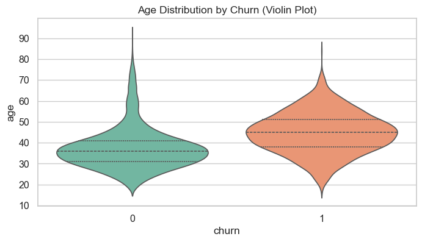
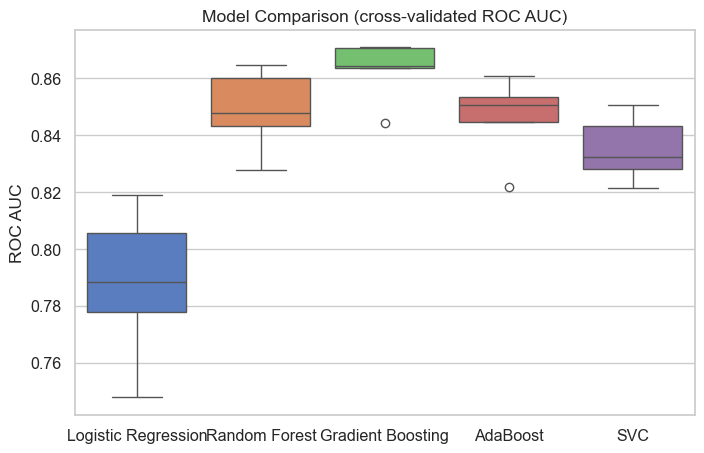
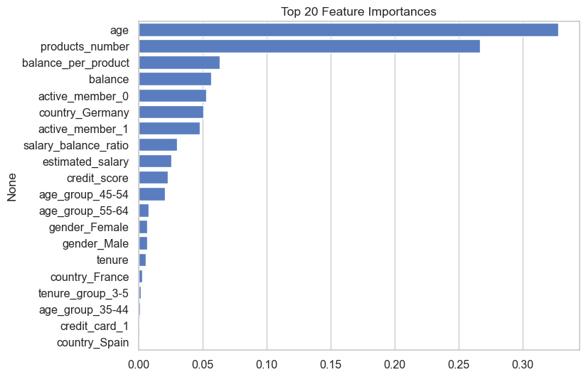

# 🏦 Bank Customer Churn Prediction

An end-to-end machine learning pipeline that predicts which bank customers are likely to churn, using 5 benchmarked classification models and feature engineering to surface the key drivers behind customer attrition.

**Best model: Gradient Boosting — 86.9% ROC-AUC | 86.8% Test Accuracy**

---

## 📌 Overview

Customer churn is one of the costliest problems for banks — acquiring a new customer is far more expensive than retaining one. This project builds a complete pipeline to predict churn risk from customer profile and account data, so that at-risk customers can be identified and targeted with retention efforts before they leave.

The pipeline covers:
- Data cleaning & exploratory data analysis (EDA)
- Feature engineering
- Preprocessing (imputation, scaling, encoding) via `ColumnTransformer`
- Model benchmarking across 5 algorithms with cross-validation
- Final model evaluation, feature importance analysis, and serialization for reuse

---

## 📊 Dataset

- **Source:** Bank customer records — 10,000 rows
- **Target variable:** `churn` (1 = customer left the bank, 0 = retained)
- **Features:** Credit score, geography, gender, age, tenure, balance, number of products, credit card ownership, active membership status, estimated salary

---

## 🔍 Exploratory Data Analysis

A few key patterns surfaced during EDA:

**Correlation between numerical features**



**Churn rate increases sharply with number of products held**



**Age distribution differs notably between churned and retained customers**



---

## ⚙️ Feature Engineering

New features were engineered to strengthen model signal beyond the raw columns:
- `balance_per_product` — account balance divided by number of products held
- `salary_balance_ratio` — estimated salary relative to account balance
- `age_group` — binned age brackets
- `tenure_group` — binned tenure brackets

---

## 🤖 Model Benchmarking

Five classification models were trained and compared using **5-fold stratified cross-validation** on ROC-AUC:

| Model | Mean CV ROC-AUC | Std |
|---|---|---|
| Logistic Regression | 0.7877 | 0.0244 |
| Random Forest | 0.8486 | 0.0130 |
| **Gradient Boosting** ⭐ | **0.8628** | **0.0097** |
| AdaBoost | 0.8462 | 0.0133 |
| SVC | 0.8351 | 0.0104 |



**Gradient Boosting** was selected as the final model — it had both the highest mean AUC and the lowest variance across folds.

---

## ✅ Final Model Performance (Held-out Test Set)

| Metric | Score |
|---|---|
| Accuracy | 86.80% |
| ROC-AUC | 86.92% |
| Precision (churn class) | 0.78 |
| Recall (churn class) | 0.49 |
| F1-Score (churn class) | 0.60 |

> Precision is prioritized over recall here — for a bank, a false alarm (flagging a loyal customer as at-risk) is far cheaper than missing a retention opportunity, but it's still worth noting recall has room to improve with further tuning or class-balancing techniques (e.g. SMOTE).

---

## 🔑 Feature Importance

Understanding *why* the model predicts churn matters as much as the prediction itself:



**Age** and **number of products held** emerged as the two strongest predictors of churn — a clear, actionable signal for the bank's retention team to target specific customer segments.

---

## 🛠️ Tech Stack

- **Language:** Python
- **Data handling:** Pandas, NumPy
- **Visualization:** Matplotlib, Seaborn
- **Machine Learning:** Scikit-learn (Logistic Regression, Random Forest, Gradient Boosting, AdaBoost, SVC)
- **Model persistence:** Joblib

---

## 🚀 How to Run

```bash
# Clone the repository
git clone https://github.com/mayankpanwar15376-tech/Bank_Customer_Churn_Prediction.git
cd Bank_Customer_Churn_Prediction

# Install dependencies
pip install pandas numpy matplotlib seaborn scikit-learn joblib

# Launch the notebook
jupyter notebook analysis.ipynb
```

---

## 📁 Repository Structure

```
├── analysis.ipynb                      # Full analysis notebook (EDA → modeling → evaluation)
├── Bank_Customer_Churn_Prediction.csv  # Dataset
├── images/                             # Chart exports used in this README
└── README.md
```

---

## 📈 Possible Next Steps

- Address class imbalance with SMOTE/class-weighting to improve recall
- Hyperparameter tuning via GridSearchCV/Optuna on the Gradient Boosting model
- Deploy as a live prediction app (Streamlit/FastAPI) for interactive churn scoring

---

## 👤 Author

**Mayank Panwar**
[GitHub](https://github.com/mayankpanwar15376-tech) · [LinkedIn](https://www.linkedin.com/in/mayank-panwar-9a988725a)
